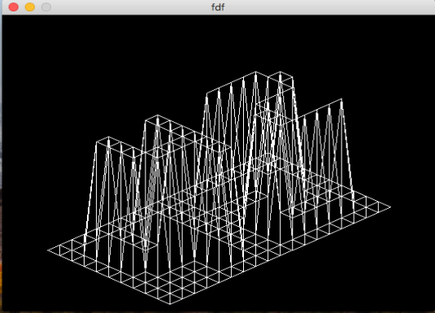
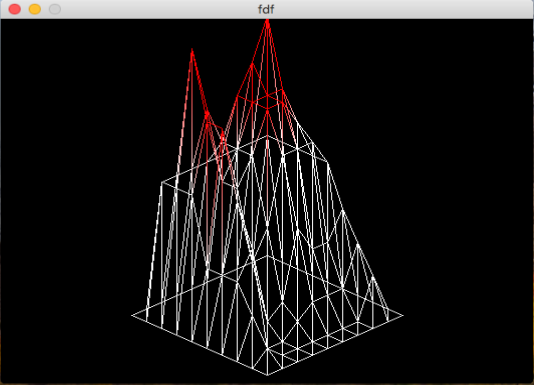

# fdf (42 project)

## Description

Draw 3d wireframes from 2d maps using the [Minilibx](https://github.com/42Paris/minilibx-linux) graphical engine

### Example of raw map and its wireframe:

```0 0  0  0  0  0  0  0  0  0  0  0  0  0  0  0  0  0  0
0  0  0  0  0  0  0  0  0  0  0  0  0  0  0  0  0  0  0
0  0 10 10  0  0 10 10  0  0  0 10 10 10 10 10  0  0  0
0  0 10 10  0  0 10 10  0  0  0  0  0  0  0 10 10  0  0
0  0 10 10  0  0 10 10  0  0  0  0  0  0  0 10 10  0  0
0  0 10 10 10 10 10 10  0  0  0  0 10 10 10 10  0  0  0
0  0  0 10 10 10 10 10  0  0  0 10 10  0  0  0  0  0  0
0  0  0  0  0  0 10 10  0  0  0 10 10  0  0  0  0  0  0
0  0  0  0  0  0 10 10  0  0  0 10 10 10 10 10 10  0  0
0  0  0  0  0  0  0  0  0  0  0  0  0  0  0  0  0  0  0
0  0  0  0  0  0  0  0  0  0  0  0  0  0  0  0  0  0  0
```



### Another example with color gradients
```0  0  0  0  0  0  0  0  0  0
0 10 10 10 10 10 10 10 10  0
0 10 20,0xFF0000 15,0xFF0000 12 15,0xFF0000 17,0xFF0000 20,0xFF0000 10  0
0 10 15,0xFF0000 10 12 15,0xFF0000 15,0xFF0000 15,0xFF0000 10  0
0  5 15,0xFF0000 10 12 15,0xFF0000 15,0xFF0000 13 10  0
0  5 10  5  7 12 12 12 10  0
0  5  7  1  2  7  5  5  7  0
0  3  0  0  1  2  2  2  5  0
0  1  0  0  0  0  0  0  3  0
0  0  0  0  0  0  0  0  0  0
```


## Description

Graphical

## Instructions and usage

-   `make`
-   Usage : `./fdf [map.fdf] <filename> [ case_size z_size ]` where _case_size_ param is the square width and _z-size_ is the proportion and orientation of z-axis.

